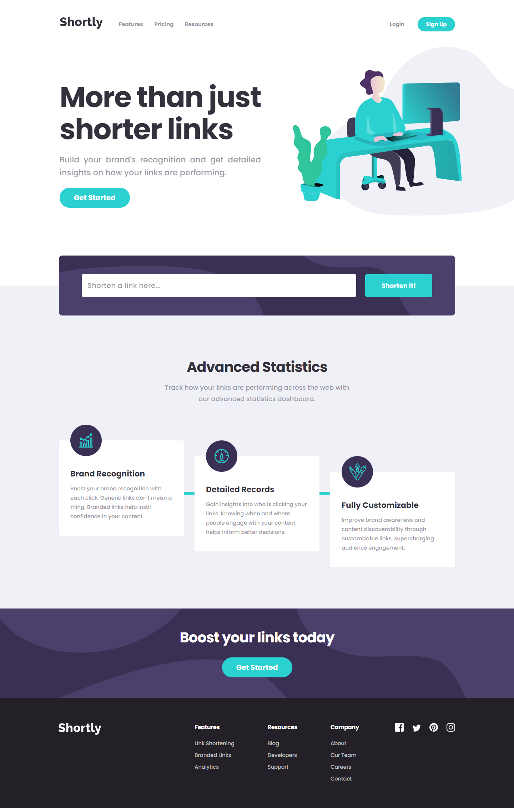

# Frontend Mentor - Shortly URL shortening API Challenge solution

This is a solution to the [Shortly URL shortening API Challenge challenge on Frontend Mentor](https://www.frontendmentor.io/challenges/url-shortening-api-landing-page-2ce3ob-G). Frontend Mentor challenges help you improve your coding skills by building realistic projects. 

## Table of contents

- [Overview](#overview)
  - [The challenge](#the-challenge)
  - [Screenshot](#screenshot)
  - [Links](#links)
- [My process](#my-process)
  - [Built with](#built-with)
  - [Continued development](#continued-development)
  - [Useful resources](#useful-resources)
- [Author](#author)

## Overview

### The challenge

Users should be able to:

- View the optimal layout for the site depending on their device's screen size
- Shorten any valid URL
- Copy the shortened link to their clipboard in a single click
- Receive an error message when the `form` is submitted if:
  - The `input` field is empty
<!-- - See a list of their shortened links, even after refreshing the browser -->

### Screenshot

- Desktop View and Mobile View

---

### Links

- Solution URL: [Add solution URL here](https://your-solution-url.com)
- Live Site URL: [Add live site URL here](https://your-live-site-url.com)

## My process

### Built with

- Semantic HTML5 markup
- Flexbox
- Mobile-first workflow
- TypeScript
- [React (TypeScript)](https://reactjs.org/) - JS library

### Continued development

Plain old CSS in components as a styling method in react projects becomes hard to manage as the project scales, causing name collitions with class names among React Components, in the future I will try other styling methods in react such as Styled Components or CSS Modules.

### Useful resources

- [W3 Schools](https://www.w3schools.com/default.asp) - Amazing page to find references on how to do certain actions or how to build with html some components.
- [MDN Web Docs](https://developer.mozilla.org/en-US/) - The official page of reference for HTML, CSS and JavaScript.
- [React TypeScript CheatSheet](https://react-typescript-cheatsheet.netlify.app) - Reference page to work with React TypeScript.

## Author

- GitHub - [Rodrigo Villalobos](https://github.com/Rravg)
- Frontend Mentor - [@Rravg](https://www.frontendmentor.io/profile/Rravg)
